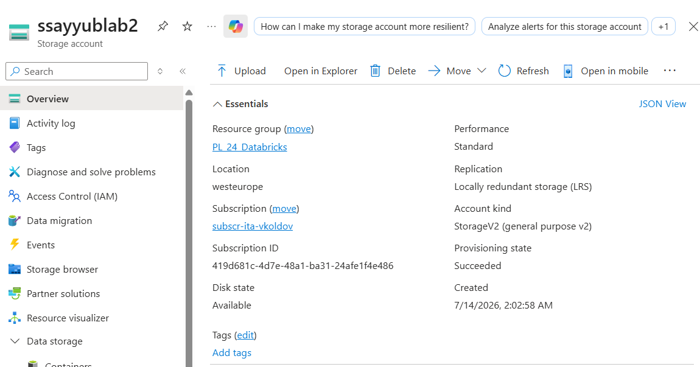
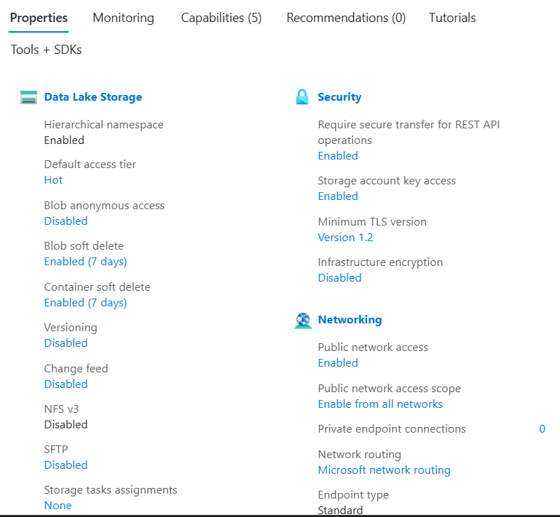
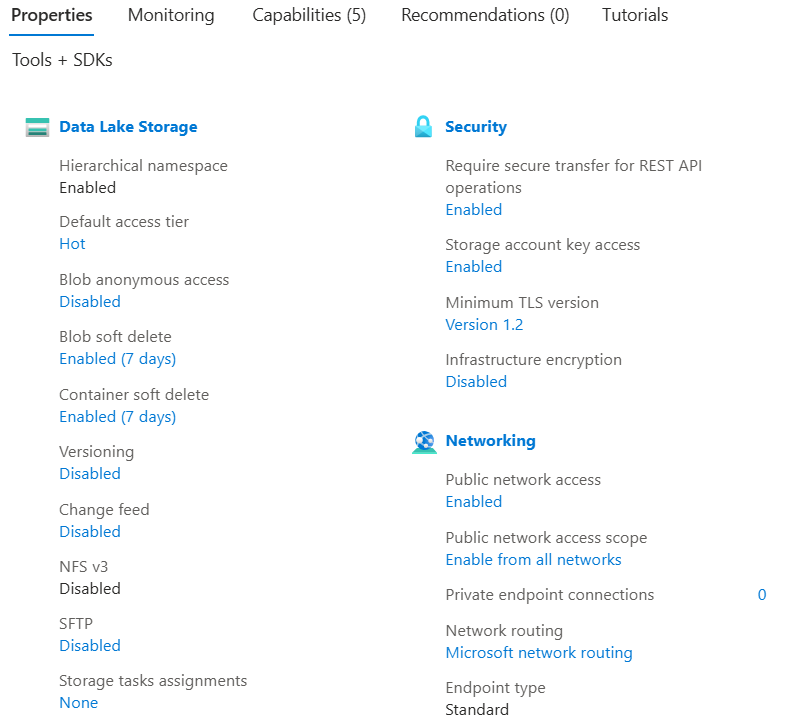
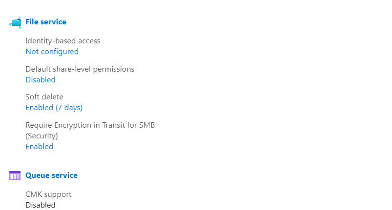
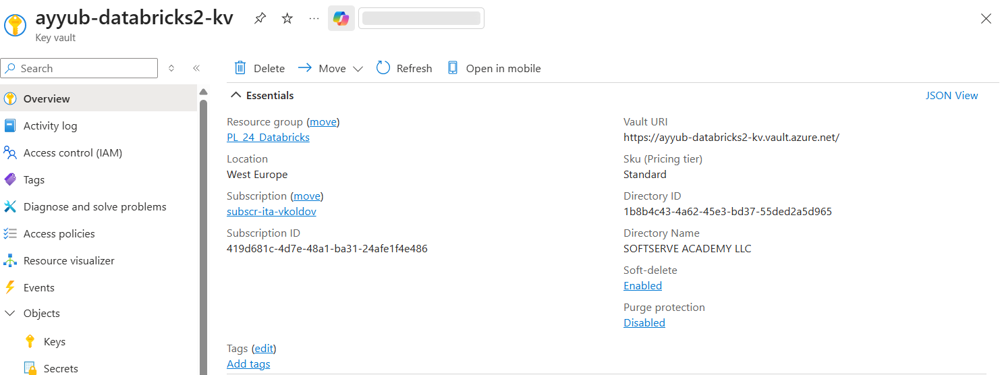
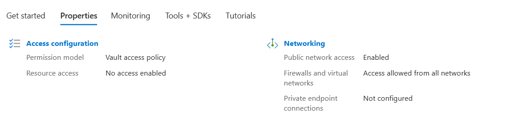
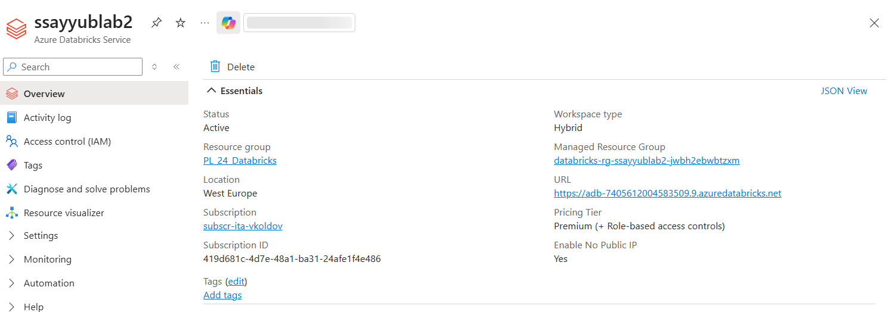

# Azure Services & Shared Lakehouse

## Overview

This project demonstrates the setup of a governed data lakehouse using Azure Data Lake Storage Gen2, Azure Databricks, Unity Catalog, and Delta Lake.

The goal was to understand both Azure resource provisioning and modern Databricks data governance practices.

The implementation includes:

- Azure resource setup
- Unity Catalog external location
- Bronze layer ingestion
- Delta Lake storage
- Auto Loader incremental ingestion
- Databricks Job execution
- Legacy Service Principal authentication

# Architecture

The implemented flow:
- ADLS Gen2
- Unity Catalog External Location
- Bronze Layer (Delta Table)
- Silver Layer
- Gold Layer

All data is stored under personal schemas inside the shared Databricks environment.

# Stage 1 - Azure Resources

For learning purposes, separate Azure resources were created to understand the configuration options and relationships between services.

## Azure Storage Account (ADLS Gen2)

Configuration highlights:

- Hierarchical namespace enabled
- ADLS Gen2 storage
- Configured redundancy and access settings
- Region aligned with other Azure resources

Screenshots:

---

## Azure Key Vault

Configuration highlights:

- Secret management service
- Azure RBAC permission model
- Soft delete enabled
- Purge protection configured

Screenshots:

---

## Azure Databricks Workspace

Configuration highlights:

- Azure Databricks workspace created
- Region matched with related Azure resources
- Workspace configuration and networking reviewed

Screenshot:

# Stage 2 - Shared Databricks Environment

The production-like implementation was performed using shared academy resources.

The following components were created:

- Personal ADLS container
- Unity Catalog external location
- Bronze/Silver/Gold schemas
- Secret scope

## Unity Catalog Structure

Personal schemas: 
|
├── ayyuborujzade_bronze
|
├── ayyuborujzade_silver
|
|── ayyuborujzade_gold

## External Location

A Unity Catalog external location was created using the shared storage credential.

This provides governed access to the personal ADLS container.

# Bronze Layer Ingestion

The Bronze layer was implemented using Apache Spark Structured Streaming and Auto Loader.

The ingestion process:

- Reads CSV files from ADLS Gen2
- Uses schema inference and schema tracking
- Writes data as Delta format
- Uses checkpointing for idempotent processing
- Adds metadata columns

Metadata columns added:

- source_filename
- ingestion_timestamp
- load_date

The final Delta table: dbr_dev.ayyuborujzade_bronze.games

# Databricks Job

A Databricks Job was created for Bronze ingestion.

Configuration:

- Existing shared all-purpose cluster used
- AvailableNow trigger configured
- Checkpoint location used for incremental processing

# Legacy Service Principal Access

A legacy Azure Service Principal authentication method was tested.

The process included:

- Reading Service Principal credentials from a Databricks secret scope
- Configuring OAuth authentication
- Connecting to ADLS Gen2 using ABFS path

The traditional `dbutils.fs.mount()` approach was attempted.

However, the academy shared cluster does not allow mount operations because the method is not whitelisted.

The same authentication method was successfully tested through direct ADLS access using Spark configuration.

# Technologies Used

- Azure Data Lake Storage Gen2
- Azure Key Vault
- Azure Databricks
- Unity Catalog
- Delta Lake
- Apache Spark
- Structured Streaming
- Auto Loader

# Repository Contents
- notebooks/Lab02_Azure_Medallion_Lakehouse.ipynb

- screenshots/Azure resource and Databricks screenshots
