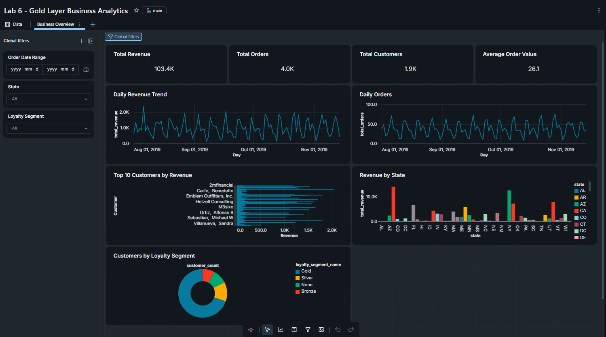
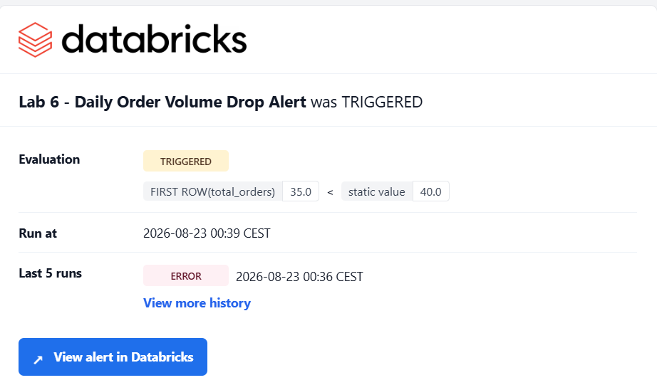
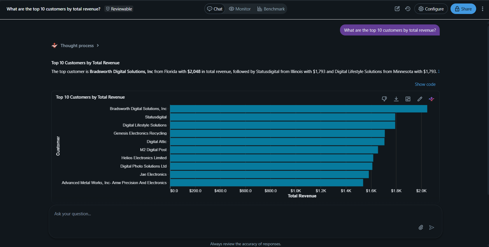

# Lab 6 - Gold Layer

## Overview

This lab builds the **Gold layer** of an e-commerce data platform using Databricks.

The Gold layer transforms the existing Silver data into an analytics-ready star schema, business aggregates, governance controls, validation checks, a business dashboard, an alert, and a Genie Q&A experience.

The implementation follows the **Medallion Architecture**:

```
Bronze
   ↓
Silver
   ↓
Gold
   ↓
Dashboard / Alert / Genie Q&A
```

---

## Gold Layer Architecture

The Gold layer consists of:

- **3** dimension tables
- **1** fact table
- **2** aggregate tables

### Dimensions

| Table | Description |
|---|---|
| `lab5.gold.dim_date` | Date dimension with standard calendar attributes |
| `lab5.gold.dim_customers` | Customer information, loyalty segments, and SCD Type 2 history |
| `lab5.gold.dim_products` | Product information and ordering history |

### Fact

| Table | Description |
|---|---|
| `lab5.gold.fct_sales_orders` | Sales order line items with customer, product, date, quantity, and revenue measures |

### Aggregations

| Table | Description |
|---|---|
| `lab5.gold.agg_customer_summary` | Customer-level sales and lifetime-value metrics |
| `lab5.gold.agg_daily_sales` | Daily orders, revenue, quantity, and customer metrics |

---

## Gold Layer Data Model

```
                         ┌─────────────────┐
                         │    dim_date     │
                         │─────────────────│
                         │ date_key        │
                         │ full_date       │
                         │ year            │
                         │ quarter         │
                         │ month           │
                         │ day_of_week     │
                         └────────┬────────┘
                                  │
                                  │ date_key
                                  ▼
┌─────────────────┐       ┌─────────────────────┐       ┌─────────────────┐
│ dim_customers   │       │  fct_sales_orders   │       │  dim_products   │
│─────────────────│       │─────────────────────│       │─────────────────│
│ customer_key    │◄──────│ customer_key        │──────►│ product_key     │
│ customer_id     │       │ product_key         │       │ product_id      │
│ customer_name   │       │ date_key            │       │ product_name    │
│ state           │       │ order_id            │       │ first_order_date│
│ loyalty_segment │       │ quantity            │       │ last_order_date │
└─────────────────┘       │ revenue             │       └─────────────────┘
                          └──────────┬──────────┘
                                     │
                       ┌─────────────┴─────────────┐
                       ▼                           ▼
             ┌─────────────────────┐     ┌─────────────────────┐
             │ agg_customer_summary│     │   agg_daily_sales   │
             │─────────────────────│     │─────────────────────│
             │ customer_key        │     │ date_key            │
             │ total_orders        │     │ total_orders        │
             │ total_revenue       │     │ total_revenue       │
             │ avg_order_value     │     │ total_quantity      │
             └─────────────────────┘     │ unique_customers    │
                                         └─────────────────────┘
```
---

## Notebooks

### `01_gold_star_schema`

Creates the analytics-ready Gold layer:

- Date dimension
- Customer dimension
- Product dimension
- Sales fact table
- Customer summary
- Daily sales summary

The notebook uses target-specific catalog and schema configuration so that the same project can be deployed to different Databricks environments.

### `02_governance`

Implements Unity Catalog governance controls:

- Schema permissions
- Row-level security
- Column-level masking
- Governance validation

The customer dimension uses row-level filtering to restrict visible customer states.

The `tax_id` column is protected with column-level masking for non-admin users.

### `03_validation`

Performs final Gold-layer validation, including:

- Dimension row counts
- Fact table integrity
- Key completeness
- Aggregate reconciliation
- Date coverage
- Row-level security validation
- Column-level security validation

---

## Gold Layer Results

The completed Gold layer in the personal/free workspace contains:

| Table | Rows |
|---|---|
| dim_date | 184 |
| dim_customers | 6,541 |
| dim_products | 98 |
| fct_sales_orders | 7,907 |
| agg_customer_summary | 1,929 |
| agg_daily_sales | 106 |

These tables provide the foundation for the dashboard, alerting, and Genie Q&A functionality.

---

## Dashboard

### Lab 6 - Gold Layer Business Analytics

The dashboard provides business-level analytics based on the Gold layer.

Key metrics and visualizations include:

- Total revenue
- Total orders
- Customer count
- Average order value
- Daily revenue trend
- Daily order volume
- Revenue by state
- Top customers by revenue
- Customers by loyalty segment
- Revenue by month

**Dashboard Screenshot**



---

## Alert

### Lab 6 - Daily Order Volume Drop Alert

The alert monitors daily order volume using:

```
lab5.gold.agg_daily_sales
```

The purpose of the alert is to identify unusually low daily order volumes and notify users when the configured threshold is reached.

**Alert Screenshot**



---

## Genie Q&A

### Lab 6 Gold Layer Business Analytics

A Databricks Genie Q&A space provides a natural-language interface for exploring the Gold layer.

Users can ask questions about:

- Revenue
- Orders
- Customers
- Products
- Loyalty segments
- States
- Daily sales
- Monthly sales
- Customer performance
- Product ordering activity

The Genie space is configured with the available Gold tables and their relationships.

#### Example Questions

- What is the total revenue?
- How many total orders do we have?
- What is the average order value?
- Who are the top 10 customers by revenue?
- What is the daily revenue trend?
- How many customers are in each state?
- What is the revenue by loyalty segment?
- What are the most ordered products?
- What is the revenue by month?
- How many unique customers do we have each day?

**Genie Screenshot**



---

## Governance

Unity Catalog is used to implement governance controls across the Gold layer.

### Permissions

Access to the Gold schema and tables is controlled through Unity Catalog permissions.

### Row-Level Security

Customer records can be filtered based on state using a Unity Catalog row filter.

Example business rule:

```
CA
NY
TX
```

Only records satisfying the configured row-level security policy are visible to the relevant users.

### Column-Level Security

The `tax_id` column is protected using a masking function.

Administrators can view the original value, while other users receive a redacted value:

```
REDACTED
```

---

## Validation

The Gold layer is validated using the `03_validation` notebook.

Validation includes:

**Dimensions**
- Expected row counts
- Unique keys
- Null checks
- Date coverage
- Attribute completeness

**Fact Table**
- Foreign-key completeness
- Customer key validity
- Product key validity
- Date key validity
- Revenue and quantity checks

**Aggregates**
- Customer-level reconciliation
- Daily sales reconciliation
- Revenue consistency
- Order count consistency
- Quantity consistency

**Governance**
- Row-level security validation
- Column-level masking validation
- Unity Catalog permission checks

---

## Technologies

- Databricks
- Unity Catalog
- Spark SQL
- PySpark
- Delta Lake
- Lakehouse / Medallion Architecture
- Databricks Asset Bundles
- Databricks AI/BI Dashboards
- Databricks Genie
- SQL Alerts

---

## Project Structure

```
lab6_gold_layer/
│
├── 01_gold_star_schema.py
├── 02_governance.py
├── 03_validation.py
├── README.md
│
├── screenshots/
│   ├── dashboard.png
│   ├── genie.png
│   └── alert.png
│
├── resources/
│   ├── lab6_dashboard.yml
│   └── ...
│
├── Lab 6 - Gold Layer Business Analytics.lvdash.json
└── Lab 6 - Daily Order Volume Drop Alert.dbalert.json
```

---

## Final Result

Lab 6 provides a complete analytics-ready Gold layer containing:

- Star schema modeling
- Business aggregates
- Data validation
- Unity Catalog governance
- Row-level security
- Column-level security
- Business dashboard
- Data-quality / business alerting
- Natural-language data exploration with Genie
- Databricks Asset Bundle deployment
