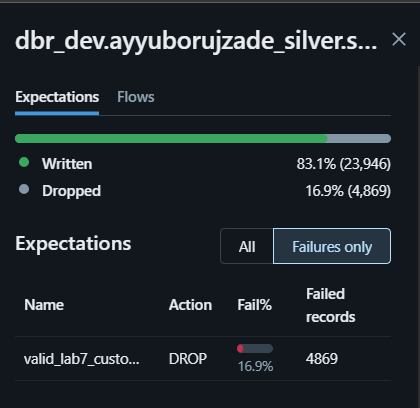
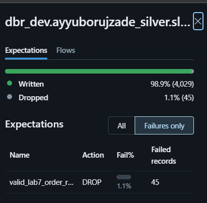
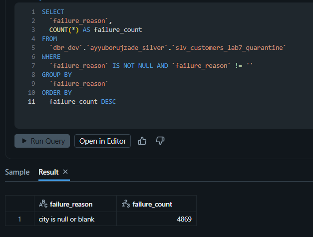
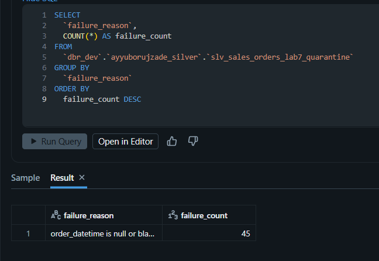
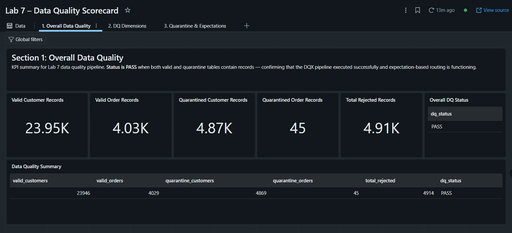
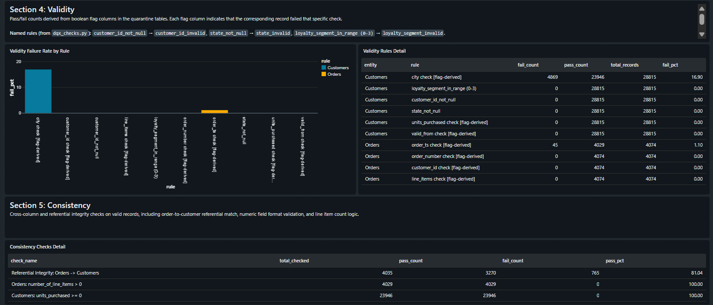
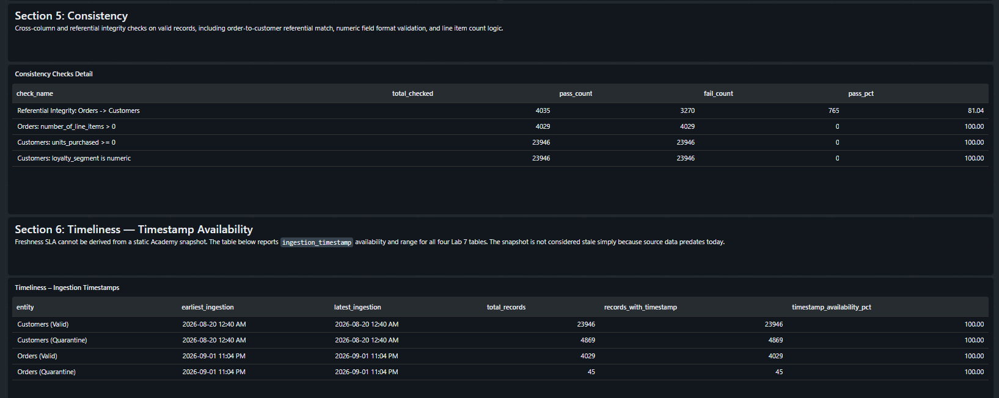
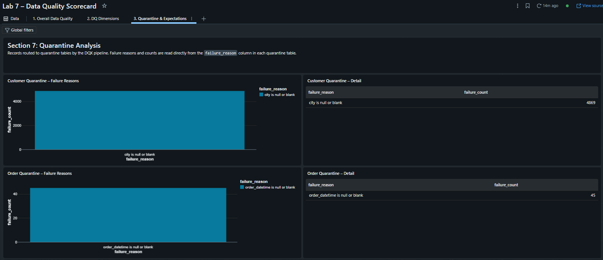
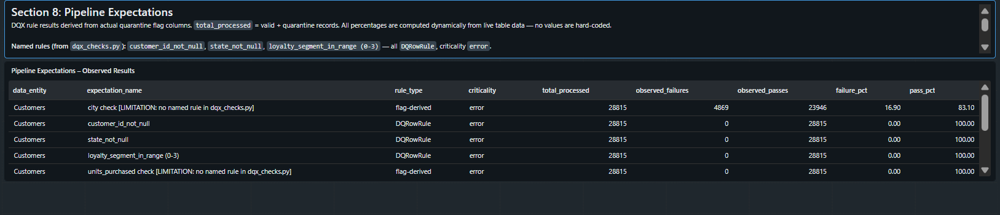
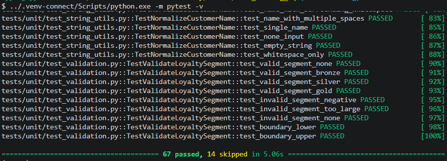

# Lab 7: Testing and Data Quality

## Project Overview

Lab 7 adds Python/pytest testing and Databricks Lakeflow data-quality validation around the existing medallion data. Lab 4-6 production pipelines are unchanged.

## Objectives

- Test transformation and validation logic with deterministic unit tests.
- Validate data quality across Bronze, Silver, and Gold.
- Preserve rejected Silver records for inspection.
- Verify reconciliation, referential integrity, and pipeline outputs in the Academy workspace.

## Architecture and Data Flow

```text
Bronze source tables
	|
	v
lab7_pipeline (Lakeflow)
	|
	+--> Silver valid tables
	+--> Silver quarantine tables with failure_reason
	|
	v
Gold reconciliation and referential-integrity checks
```

Academy catalog and schemas:

```text
Catalog: dbr_dev
Bronze:  ayyuborujzade_bronze
Silver:  ayyuborujzade_silver
Gold:    ayyuborujzade_gold
```

The deployed pipeline is `lab7_pipeline`.

## Testing Approach

Unit tests cover importable Python transformation and validation modules, including string normalization, timestamp parsing, loyalty mapping, calculations, failure reasons, and DQ checks.

Integration tests use Databricks Connect against the Academy cluster. They validate Lakeflow branch reconciliation, completeness, uniqueness, validity, consistency, referential integrity, reconciliation, and DQX results.

Run unit tests:

```bash
cd week07/lab7_testing_dq
../.venv-connect/Scripts/python.exe -m pytest tests/unit -q
```

## Data Quality Dimensions

The project covers:

- Completeness: required fields are not null or blank.
- Uniqueness: duplicate business and primary keys are detected.
- Validity: ranges, accepted values, formats, and numeric values are checked.
- Consistency: cross-table references and aggregate reconciliation are verified.
- Timeliness: the freshness rule is tested with controlled fresh and stale timestamps.

## Lakeflow Expectations and Quarantine

The pipeline reads Bronze source tables and writes these Academy Silver tables:

```text
dbr_dev.ayyuborujzade_silver.slv_customers_lab7_valid
dbr_dev.ayyuborujzade_silver.slv_customers_lab7_quarantine
dbr_dev.ayyuborujzade_silver.slv_sales_orders_lab7_valid
dbr_dev.ayyuborujzade_silver.slv_sales_orders_lab7_quarantine
```

Customer expectation:

- Name: `valid_lab7_customer_record`
- Action: `DROP`
- Rules: required customer fields, `loyalty_segment` from 0 to 3, and non-negative numeric `units_purchased`.
- Result: 4,869 failed records, a 16.9% failure rate.
- Quarantine reason: `city is null or blank` for 4,869 records.

Order expectation:

- Name: `valid_lab7_order_record`
- Action: `DROP`
- Rules: required order/customer fields, positive `number_of_line_items`, and a non-blank order timestamp.
- Result: 45 failed records, a 1.1% failure rate.
- Quarantine reason: `order_datetime is null or blank` for 45 records.

Rejected records are preserved in the corresponding quarantine tables with their original fields and a `failure_reason` column.

## Reconciliation and Validation

The integration suite verifies that valid and quarantine branches account for the Bronze source rows, valid rows satisfy the configured predicates, and quarantined rows contain a failure reason. Gold checks cover fact primary-key uniqueness, customer/product/date references, and revenue and order-count reconciliation with aggregate tables.

The Academy data is a static snapshot. Integration validation checks timestamp availability; controlled unit tests verify that the freshness rule detects stale data without applying a live SLA to the snapshot.

## DQ Scorecard Dashboard

The Databricks dashboard **Lab 7 - Data Quality Scorecard** uses only the four Lab 7 Silver valid/quarantine tables listed above. It contains 3 pages, 9 datasets, and 26 widgets covering:

- Overall data quality
- Completeness
- Uniqueness
- Validity
- Consistency
- Timestamp availability and timeliness
- Quarantine analysis
- Pipeline expectation results

These dashboard views summarize quality results and are not all named DQX rules.

## Test Results

The local full pytest run reports:

```text
67 passed, 14 skipped
```

The 14 skipped tests are integration tests that require the Academy integration environment to be enabled.

## Screenshots / Evidence

Pipeline and quarantine evidence:







DQ Scorecard evidence:







Pytest evidence:



## Deployment and Usage

Validate the Academy bundle:

```bash
cd week07/lab7_testing_dq
databricks bundle validate --target academy --profile adb-7405604503619901
```

Deploy the pipeline:

```bash
databricks bundle deploy --target academy --profile adb-7405604503619901
```

Run Academy integration tests with Databricks Connect:

```bash
export DATABRICKS_CONFIG_PROFILE="adb-7405604503619901"
export DATABRICKS_RUN_INTEGRATION="1"
export DATABRICKS_CLUSTER_ID="0702-132442-toro5spu"
export DATABRICKS_CATALOG="dbr_dev"
export DATABRICKS_BRONZE_SCHEMA="ayyuborujzade_bronze"
export DATABRICKS_SILVER_SCHEMA="ayyuborujzade_silver"
export DATABRICKS_GOLD_SCHEMA="ayyuborujzade_gold"

timeout 300s ../.venv-connect/Scripts/python.exe -m pytest tests/integration -v
../.venv-connect/Scripts/python.exe -m pytest -q
```

## Completion Summary

Lab 7 includes unit and integration testing, Lakeflow expectations with quarantine outputs, medallion DQ validation, Gold reconciliation checks, and the **Lab 7 - Data Quality Scorecard** dashboard. The documented Academy results are supported by the screenshots in `screenshots/`.
