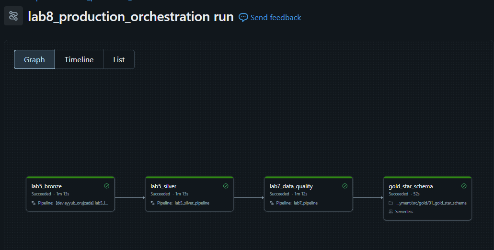

# Lab 8 - Production Deployment

Lab 8 uses Databricks Asset Bundles to deploy and orchestrate the existing Bronze, Silver, Lab 7 data-quality, and Gold components in the Academy PROD environment. GitHub Actions validates the project and deploys the production bundle on pushes to `main`.

This README is intentionally kept as the project reference for the bundle and CI flow; any change here is only to keep the Lab 8 project visible to the repo-triggered GitHub Actions workflow.

## Purpose

The bundle connects the existing Lab 5 and Lab 7 pipelines to the Lab 8 Gold notebook task. It uses target-specific catalog, schema, and dashboard settings.

The structure is meant to support:

- a local `dev` target for validation
- a separate `prod` target for the production workspace
- repeated deployment logic with target-specific variables
- GitHub-based validation and deployment checks

## Bundle structure

The root bundle is defined in `databricks.yml`. It syncs the Lab 5 and Lab 7 folders together with the current Lab 8 project, and it includes all resource YAML files under `resources/`.

The bundle declares these variables:

- `catalog`
- `bronze_schema`
- `silver_schema`
- `gold_schema`
- `warehouse_id`

These values are set differently for the `dev` and `prod` targets.

## Targets

### `dev`

- Host: https://dbc-f7231d90-d8a3.cloud.databricks.com
- Default target
- Catalog: `lab5`
- Bronze schema: `bronze`
- Silver schema: `silver`
- Gold schema: `gold`
- Dashboard file: `dashboards/Lab 8 - Gold Layer Business Analytics.lvdash.json`

### `prod`

- Host: https://adb-7405604503619901.1.azuredatabricks.net
- Catalog: `dbr_dev`
- Bronze schema: `ayyuborujzade_bronze`
- Silver schema: `ayyuborujzade_silver`
- Gold schema: `ayyuborujzade_gold`
- Dashboard file: `dashboards/Lab 8 - Gold Layer Business Analytics - PROD.lvdash.json`

The workspaces are intentionally kept separate, and the target-specific `file_path` setting in `databricks.yml` switches which dashboard JSON is attached for each environment.

## Deployed resources

The bundle includes the main resources below.

### Schemas

`resources/schemas.yml` creates the Bronze, Silver, and Gold schemas in the target catalog.

### Pipelines

`resources/pipelines.yml` defines the bundle resources for:

- `lab5_silver_pipeline`
- `lab7_pipeline`

The Bronze task references the existing Academy pipeline directly from `resources/jobs.yml`.

### Job orchestration

`resources/jobs.yml` defines `lab8_production_orchestration`.

The production job, `lab8_production_orchestration`, runs these dependent tasks in order:

1. Bronze — existing Academy Lab 5 Bronze pipeline (`lab5_bronze`).
2. Silver — existing Academy Silver pipeline (`lab5_silver`), after Bronze.
3. Lab 7 Data Quality — existing Lab 7 pipeline (`lab7_data_quality`), after Silver.
4. Gold — notebook task (`gold_star_schema`), after the data-quality task.

The Gold task runs `src/gold/01_gold_star_schema.ipynb` with the target catalog and schema parameters.

The Bronze pipeline owns the Bronze outputs, and the Silver pipeline owns the three Silver outputs. The existing Silver tables were assigned to the Silver pipeline by updating their Databricks pipeline ownership metadata; the tables were not dropped or recreated. The Lab 7 pipeline handles the data-quality layer, and the Gold notebook builds the Gold outputs.



### Gold notebook

`src/gold/01_gold_star_schema.ipynb` is the Lab 8 parameterized version of the Gold star-schema transformation. It uses notebook widgets for the catalog and schema names so the same notebook can run in different targets.

### Dashboards

`resources/dashboard.yml` registers the dashboard resource with the bundle and sets the warehouse ID and parent path. The actual dashboard file is selected from `databricks.yml` depending on the target.


## Why there are two dashboard files

The two dashboard JSON files are kept because the underlying data source names are different in each environment.

- The DEV dashboard sources point to `lab5.gold.agg_daily_sales` and `lab5.gold.agg_customer_summary`.
- The PROD dashboard sources point to `dbr_dev.ayyuborujzade_gold.agg_daily_sales` and `dbr_dev.ayyuborujzade_gold.agg_customer_summary`.

The dashboard JSON is static, so the bundle uses a target-specific dashboard file path instead of trying to parameterize the source table names inside the exported dashboard JSON. This is the safest simple approach for the current setup.

## GitHub Actions workflow

The workflow is defined in `.github/workflows/lab8-ci.yml`. Pull requests run the local checks. A push to `main` runs the PROD deployment job after those checks pass.

The checks job checks out the repository, sets up Python, installs the Lab 7 test dependencies and PyYAML, and installs the Databricks CLI. It then validates the Lab 8 YAML and JSON files, notebook structure and Python syntax, pipeline file references, and orchestration task order. It also runs the Lab 7 unit tests.

The PROD job checks out the repository, installs the required tools, runs the project checks and tests, validates the bundle for the PROD target, binds the existing Academy resources, and deploys the PROD bundle. It uses the `DATABRICKS_PROD_HOST` and `DATABRICKS_PROD_TOKEN` GitHub secrets.

## Intended deployment flow

The project is intended to work like this:

1. Validate the repo and bundle locally or in PR checks.
2. Use the `dev` target for routine validation and bundle checks.
3. Use the `prod` target only for the production workspace deployment path.
4. Keep environment-specific catalog names, schema names, and dashboard files separate by target.
5. Handle workspace-specific permissions and governance setup in the target workspace rather than assuming they are fully represented in the repo.

This is a bundle-oriented lab project, not a fully managed enterprise deployment system. The code is structured to be practical and portable across the two Databricks environments it defines.

## Project structure

```text
lab8_production_deployment/
├── .github/
│   └── workflows/
│       └── lab8-ci.yml
├── dashboards/
│   ├── Lab 8 - Gold Layer Business Analytics.lvdash.json
│   ├── Lab 8 - Gold Layer Business Analytics - PROD.lvdash.json
│   └── README.md
├── governance/
│   └── README.md
├── resources/
│   ├── dashboard.yml
│   ├── jobs.yml
│   ├── pipelines.yml
│   └── schemas.yml
├── src/
│   └── gold/
│       └── 01_gold_star_schema.ipynb
├── tests/
│   └── README.md
├── databricks.yml
├── README.md
```

This project is intentionally kept small and focused on the bundle, deployment flow, and target-specific configuration needed for a Lab 8 handoff.
