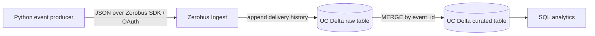

# Lab 11 — Zero-Bus Streaming with Zerobus

## Objective

Build a small event producer that sends JSON records directly to a Unity Catalog
Delta table through Databricks Zerobus Ingest. Free workspace validation has
been completed: five events were ingested, replay yielded ten raw rows for five
distinct event IDs, and repeated deduplication kept the curated table at five
logical rows. These are the reported Free-workspace results; this local audit
did not access the workspace.

## Architecture



The producer targets the confirmed table `lab5.default.lab11_events`. The SQL
also defines `lab5.default.lab11_events_deduplicated` for the idempotent
processing step. The SQL is documentation only and has not been run here.

## Producer and event IDs

`src/events.py` produces deterministic sample events with `event_id`,
`event_type`, `event_time`, `producer_id`, and a small payload. `event_time` is
encoded as a UTC ISO 8601 string ending in `Z`, compatible with the target
`TIMESTAMP` column. The ID is a
UUID5 derived from producer ID and sequence number; invoking the producer again
with the same `--start`, `--count`, and `--producer-id` intentionally resends
the same logical IDs. `src/producer.py` uses the maintained
`databricks-zerobus-ingest-sdk` synchronous JSON API, queues with
`ingest_record_offset()`, flushes to wait for acknowledgments, and closes the
stream in a `finally` block.

Delivery is not business-level idempotency: Zerobus does not deduplicate by
`event_id`. Raw ingestion is append-oriented and can contain repeated delivery
attempts. The curated processing rule uses `MERGE` keyed by `event_id`, so
re-running the merge does not add a second logical row. `src/idempotency.py`
models the first-occurrence rule in a local, credential-free helper.

## Zerobus versus Kafka

Both designs can support event-driven producers that are decoupled from the
timing of downstream processing. Kafka-style systems publish to a broker topic;
multiple independent consumer groups can fan the stream out to different
systems and replay retained events. The broker also adds infrastructure,
retention, security, monitoring, and connector operations.

Zerobus sends producer records straight to a Databricks UC Delta table. It is a
single-sink design: Databricks lakehouse storage is the destination, with no
central broker to operate. It suits lakehouse ingestion and reduces moving
parts, but it does not itself provide Kafka's generalized multi-sink fan-out
and consumer-group model. Additional destinations or replay workflows need
their own design. Costs depend on actual ingestion volume, retention, region,
networking, and Databricks pricing; this lab makes no unverified cost claim.

## Configuration and authentication

Public connection and table settings are configurable through environment
variables. Defaults match the confirmed Free workspace and target. The client
ID is a non-secret default that can be overridden. The client secret comes only
from Databricks Secrets using `dbutils.secrets.get(scope="lab11_zerobus",
key="client_secret")`; the producer does not read a secret from environment
variables or dotenv files.

| Variable | Purpose |
| --- | --- |
| `DATABRICKS_HOST` | Workspace URL (default: inspected Free workspace host) |
| `DATABRICKS_WORKSPACE_ID` | Workspace ID used to derive endpoint (default: inspected Free workspace ID) |
| `ZEROBUS_ENDPOINT` | Optional explicit endpoint; defaults to the inspected us-east-2 endpoint |
| `ZEROBUS_CLIENT_ID` | OAuth service principal application ID (default: confirmed Lab 11 producer SP) |
| `ZEROBUS_CATALOG` | Target catalog (default `lab5`) |
| `ZEROBUS_SCHEMA` | Target schema (default `default`) |
| `ZEROBUS_TABLE` | Raw target table (default `lab11_events`) |

The confirmed service principal has `USE CATALOG` on `lab5`, `USE SCHEMA` on
`lab5.default`, and `SELECT`/`MODIFY` on `lab5.default.lab11_events`. Its secret
is stored in the workspace secret scope/key above. These details do not mean
that the producer has authenticated or ingested data.

## Local setup and tests

From this directory:

```powershell
python -m pip install -r requirements.txt
python -m pytest -q
```

The unit tests cover event IDs/schema, configuration and secret lookup through
a mocked `dbutils`, and the pure idempotency helper. They do not connect to
Databricks. The SDK import used by the producer is lazy, so tests need no SDK,
credentials, or network. Testing `send_events` directly uses a mocked SDK/stream.

## Free Databricks validation

1. Use a notebook in the confirmed Free workspace and make this project
   importable in its Python path.
2. Install requirements in that notebook environment if the SDK is not present.
3. From a notebook cell, pass notebook-provided `dbutils`; the secret is read
   from the confirmed scope/key at runtime:

   ```python
   from src.producer import run_producer
   run_producer(dbutils=dbutils, count=5, start=0)
   ```

4. Query `lab5.default.lab11_events` for the pushed events.
5. To demonstrate replay and idempotency, invoke again with the same event
   sequence, then run the merge in `sql/create_tables.sql` and verify that the
   curated table has one row per `event_id`.

The reported validation results are: five unique events were sent; replaying
the same IDs produced ten rows in the raw table and five distinct IDs; the
deduplication `MERGE` produced five curated rows and a second merge kept the
curated count at five. This local repository audit did not repeat those
workspace operations.

## Compatibility and limitations

The producer follows the current maintained Python SDK API documented by
Databricks: `ZerobusSdk(endpoint, workspace_url)`, `TableProperties(table)`,
`create_stream(client_id, client_secret, properties)`,
`ingest_record_offset()`, `flush()`, and `close()`. The current SDK documents
Python 3.9–3.14 and Windows x86_64 wheels. The requirement uses a `>=0.3.0`
lower bound to avoid the older deprecated `ingest_record()` API. The SDK is not
installed in the local verification environment; the local suite mocks it.
The Free-workspace ingestion results above are reported as verified, but this
audit did not independently reproduce them.

This is a bounded teaching producer, not a durable production event service:
there is no local outbox, scheduled retry queue, schema evolution strategy, or
multi-destination routing. A failure is surfaced to the caller; stable IDs let
the processing layer handle replays. JSON is chosen for clarity, while
Protobuf/Arrow may suit higher-throughput production workloads.
